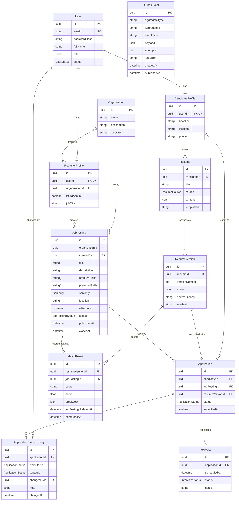

# Data model

The schema lives in [`prisma/schema.prisma`](../prisma/schema.prisma). This document explains the shape of the data and the decisions behind it.

## Entity-relationship diagram

`OutboxEvent` has no relations by design; it refers to aggregates by type and id only.

## Models

**User** (`users`) is the account: email, password hash, display name, role (`CANDIDATE`, `RECRUITER`, `ADMIN`) and lifecycle status. It holds only what every account needs; role-specific data lives in a profile.

**CandidateProfile** (`candidate_profiles`) holds the job-seeker's public details (headline, location, phone) and is the owner of their resumes and applications.

**RecruiterProfile** (`recruiter_profiles`) holds recruiter-specific data: an optional organization membership, whether they administer that organization, and a job title. It is the author of job postings they create.

**Organization** (`organizations`) is the hiring company. It groups recruiters and owns job postings.

**JobPosting** (`job_postings`) is an opening: title, description, required and preferred skills, seniority, location, remote flag, and a `DRAFT` / `PUBLISHED` / `CLOSED` lifecycle with publish and close timestamps. Skills are Postgres text arrays with a GIN index so "postings requiring skill X" queries stay fast.

**Resume** (`resumes`) is the candidate's live, editable document: a title, a source (`BUILDER` or `UPLOAD`), the structured JSON content and an optional template id.

**ResumeVersion** (`resume_versions`) is an immutable snapshot of a resume, numbered per resume. It stores the content as it was, the uploaded file's storage key (for uploads) and the extracted raw text used by matching.

**Application** (`applications`) is one candidate applying to one job posting with one specific resume version. It carries the current pipeline status (`SUBMITTED`, `SCREENING`, `INTERVIEW`, `OFFER`, `REJECTED`). A candidate can apply to a given posting only once.

**ApplicationStatusHistory** (`application_status_history`) is the audit trail of an application's status: each row records the previous status, the new status, who made the change and an optional note.

**MatchResult** (`match_results`) is a computed score of a resume version against a job posting by a named scorer, with a JSON breakdown explaining the score.

**Interview** (`interviews`) is a scheduled interview attached to an application, with its time, status and notes.

**OutboxEvent** (`outbox_events`) is a row in the transactional outbox: an event waiting to be published to the message broker, with retry bookkeeping.

## Key decisions

### a) UUID primary keys as native `uuid` columns

Every table uses a UUID primary key declared `@db.Uuid`, so Postgres stores 16 bytes in its native `uuid` type rather than a 36-character string. Compared with auto-increment integers, UUIDs are safe to expose in URLs (ids can't be enumerated or used to estimate volume), can be generated outside the database, and won't collide when data is merged across environments or services. The native type keeps indexes and foreign keys compact and comparisons fast. Foreign key columns are also `@db.Uuid` so both sides match.

### b) Separate `CandidateProfile` and `RecruiterProfile`, 1:1 with `User`

Authentication data is the same for everyone, but candidates and recruiters have different attributes and relations. Splitting them keeps `users` small and free of columns that are null for half the rows, lets each profile evolve independently, and makes ownership explicit: resumes and applications hang off the candidate profile, job postings off the recruiter profile. The 1:1 link is enforced with a unique `userId` and cascades on delete, so a profile cannot outlive its user. Which profile exists is governed by `User.role`.

### c) `Resume` is live content; `ResumeVersion` is an immutable snapshot

A candidate keeps editing their resume, but an application must show exactly what the recruiter was shown at submission time. So editing happens on `Resume`, and a `ResumeVersion` is created as a frozen copy when needed (for example on submitting an application or running matching). Applications reference a **version**, never the live resume, so later edits cannot silently change a submitted application or invalidate scores computed against it. Versions are numbered per resume (`@@unique([resumeId, versionNumber])`) and are never updated after creation, which is why the model has no `updatedAt`.

### d) `ApplicationStatusHistory` is append-only

`Application.status` is the current state for fast filtering; the history table records every transition (`fromStatus` → `toStatus`, who, when, why). Rows are only inserted, never updated or deleted, which gives a trustworthy audit trail, supports pipeline analytics such as time spent per stage, and lets the current status be checked against its history. `fromStatus` is null for the initial entry. The index on `(applicationId, changedAt)` serves the timeline view.

### e) `MatchResult` keying and staleness

A result is unique per `(resumeVersionId, jobPostingId, scorer)`. Because the resume side is an immutable version, a result never goes stale from the resume changing; a changed resume is simply a new version with its own results. Including `scorer` lets several scoring algorithms (or versions of one) coexist and be compared. The only thing that can change underneath a result is the job posting, so each result stores `jobPostingUpdatedAt` at computation time. A result is **stale when `jobPosting.updatedAt > matchResult.jobPostingUpdatedAt`**, and is then recomputed and upserted on its unique key. The index on `(jobPostingId, score)` supports ranking candidates for a posting.

### f) Delete behavior

| Relation                                              | Behavior | Why                                                                                                                                          |
| ----------------------------------------------------- | -------- | -------------------------------------------------------------------------------------------------------------------------------------------- |
| User → CandidateProfile / RecruiterProfile            | Cascade  | A profile is owned by its user and meaningless without it.                                                                                   |
| CandidateProfile → Resume                             | Cascade  | Resumes are owned by the candidate.                                                                                                          |
| Resume → ResumeVersion                                | Cascade  | Versions are derived from, and owned by, the resume.                                                                                         |
| CandidateProfile → Application                        | Cascade  | Applications belong to the candidate; deleting a candidate removes their data.                                                               |
| Application → ApplicationStatusHistory, Interview     | Cascade  | Owned by the application.                                                                                                                    |
| ResumeVersion → MatchResult, JobPosting → MatchResult | Cascade  | Match results are derived data and can be recomputed.                                                                                        |
| Organization → RecruiterProfile                       | SetNull  | A recruiter outlives their organization and can join another.                                                                                |
| RecruiterProfile → JobPosting (`createdBy`)           | SetNull  | A posting survives its author leaving; authorship is informational.                                                                          |
| User → ApplicationStatusHistory (`changedBy`)         | SetNull  | The audit trail must survive the deletion of the person who made a change.                                                                   |
| Organization → JobPosting                             | Restrict | An organization with job postings cannot be deleted. Postings carry applications and history, so they must be dealt with deliberately first. |
| JobPosting → Application                              | NoAction | Job postings are **closed, not deleted** (`status = CLOSED`). Deleting a posting that has applications is blocked.                           |
| ResumeVersion → Application                           | NoAction | A version in use by an application cannot be deleted, so submitted applications always keep the resume they were submitted with.             |

In short: owned or derived data cascades; references that are informational become null; anything that would destroy a hiring record is blocked.

### g) `OutboxEvent` and the transactional outbox

When a change must also be announced to other systems (for example publishing to Kafka or indexing in Elasticsearch), writing to the database and publishing to a broker cannot be made atomic together. The transactional outbox solves this: the service writes the business change **and** an `OutboxEvent` row in the same database transaction, and a separate relay reads unpublished rows (`publishedAt IS NULL`, ordered by `createdAt`, served by the `(publishedAt, createdAt)` index), publishes them and marks them published. `attempts` and `lastError` support retries and debugging. `aggregateType` / `aggregateId` are plain strings rather than foreign keys so one table can carry events for any aggregate and survive their deletion. Delivery is at-least-once, so consumers must be idempotent.

## Repository conventions

Services never call Prisma directly; they go through repositories. ESLint enforces this: importing `prisma` from `common/db` or taking value imports from `@prisma/client` is an error outside repositories, `common/db.ts`, `common/enums.ts`, `common/prisma-errors.ts` and `src/scripts/`. Enums are imported from `common/enums`.

- **One file per aggregate**, named `<name>.repository.ts`, exporting a plain object of async functions (for example `userRepository`).
- **Optional trailing `db: DbClient = prisma`** on every function. Pass a transaction client (from `withTransaction`) to compose several repository calls atomically.
- **Explicit selections.** Every query uses a named `select` constant declared with `satisfies Prisma.<Model>Select`, and the return type is derived with `Prisma.<Model>GetPayload<{ select: typeof ... }>`. Nothing returns an implicit whole row.
- **No `passwordHash`** except from `userRepository.findByEmailForAuth`.
- **Errors are mapped.** Every Prisma call goes through `withMappedErrors`, which turns P2002 into `ConflictError`, P2025 into `NotFoundError`, P2003 into `ConflictError`, and P2023 into `ValidationError`. Anything else is rethrown unchanged.
- **Lookups by id** return `null` without querying when the id is not a valid UUID, and `null` when nothing is found. They do not throw.
- **No business rules.** No permission checks and no "is this transition allowed" logic; those belong in services. (`transitionStatus` only guarantees a compare-and-set on the status the caller last saw.)
- **JSON inputs** are typed `Prisma.InputJsonValue`; runtime validation of resume content comes later.
- **Resume versions are immutable.** `resumeVersionRepository` has no update or delete functions.
- **Pagination** uses `PageParams` and `Paginated<T>`; `toSkipTake` clamps page to >= 1 and pageSize to 1..100 (default 20). List functions run `count` and `findMany` in one transaction.
